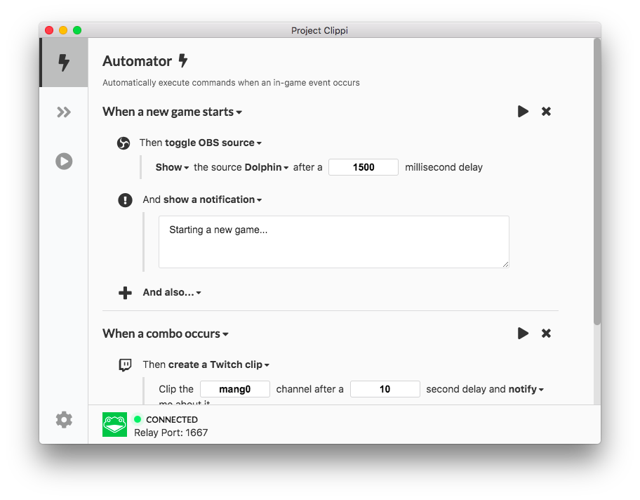

<p align="center">
  
</p>
<h1 align="center">Project Clippi</h1>

<div align="center">

An Automation Framework for Super Smash Bros. Melee

[](https://github.com/vinceau/project-clippi/actions?workflow=build)
[](https://github.com/vinceau/project-clippi/blob/master/LICENSE)

Project Clippi is your must-have Slippi toolkit for tapping into real-time game data and processing replay files. Automatically execute actions when an in-game event occurs. Automatically find and curate combos for that sick combo video. Automatically rename and reorganise your SLP files.

Everything is open source and fully-customisable. The possibilities are endless.

</div>

## Screenshots

<div align="center">

_Detect events and execute actions!_



_Built in replay processor helps you find combos and organise your SLP replays!_


_Easily play and record SLP files with a single click!_


</div>

## Highlights

- Detect in game events and execute arbitrary actions
- Customisable profiles for easy combo curation and combo video generation
- Automatically record Dolphin gameplay footage without black frames
- One-click sort and rename your SLP files with ease
- Twitch and OBS integration

## Download

Project Clippi is available on Windows, MacOS, and Linux. Check out [the releases page](https://github.com/vinceau/project-clippi/releases/latest) to download the latest version.

## Usage

To make combo videos using the Project Clippi, check out [this guide](https://medium.com/@vinceau/how-to-make-combo-videos-using-project-clippi-6bf2758f546e) on using the Replay Processor.

To turn SLP files into video using the Project Clippi, check out [this guide](https://vinceau.medium.com/how-to-turn-slp-files-into-video-using-obs-and-project-clippi-23fe0598de29) on using the Playback Queue.

To take advantage of real-time game events using the Automator, you will need to connect Project Clippi to one of the following console sources:

- Slippi Dolphin ([guide](docs/connect_to_dolphin/README.md))
- Wii Console Relay via [Slippi Desktop App](https://slippi.gg/downloads) ([guide](docs/connect_to_relay/README.md))

## Contributing

If you found Project Clippi useful and would like to give back here's how you can:

- [Spread the word!](https://twitter.com/intent/retweet?tweet_id=1215995909915336705) The more people that use it, the more Project Clippi can improve!
- If you have ideas for new features, or would like to report a bug, please tweet at [@ProjectClippi](https://twitter.com/ProjectClippi).
- If you are gifted in the way of code, you can help by adding more detectable events and more executable actions. Dive into the docs for the [`slp-realtime` library](https://github.com/vinceau/slp-realtime) which underpins this project and [the source code](https://github.com/vinceau/project-clippi) for the Project Clippi front-end.
- PRs are welcome and encouraged! Do make sure to read through [the development guidelines](CONTRIBUTING.md#development-guidelines) though.

## Development

Start the development server using:

```bash
yarn run start
```

The development server includes HMR and auto-reloading so changes to both the main and renderer processes should auto-update.

To create a binary package:

```bash
yarn run dist
```

For more detailed instructions on development and building the project from source, check out the [Build Process](CONTRIBUTING.md#build-process) section.

## Acknowledgements

Project Clippi wouldn't be here without the work of [Jas Laferriere](https://github.com/JLaferri), the rest of the [Project Slippi](https://github.com/project-slippi) team, and all the [Project Clippi supporters](SUPPORTERS.md).

## License

This software is released under the terms of [MIT license](LICENSE).
