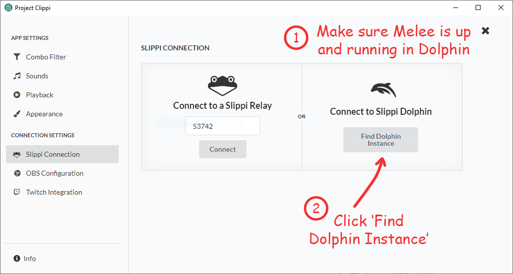
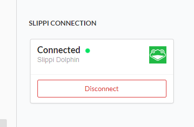

# Connecting to Slippi Dolphin

If you are playing games on Slippi Dolphin you can connect to the Dolphin instance to use Clippi Automator.

## 1. Open Slippi Dolphin and start Melee

This is critical. Slippi Dolphin **must** be already running or Clippi **cannot** find the Dolphin instance!

## 2. Setup Project Clippi

Make sure you have the latest version of Project Clippi from [the releases page](https://github.com/vinceau/project-clippi/releases).

Open up the settings page and click "Slippi Connection".

In the right hand panel click the "Find Dolphin Instance" button.

It should now say "Connected" and display the folder underneath.

## 3. Success!

You should now be ready to start customising different events and actions. Close the settings page and start automating!
