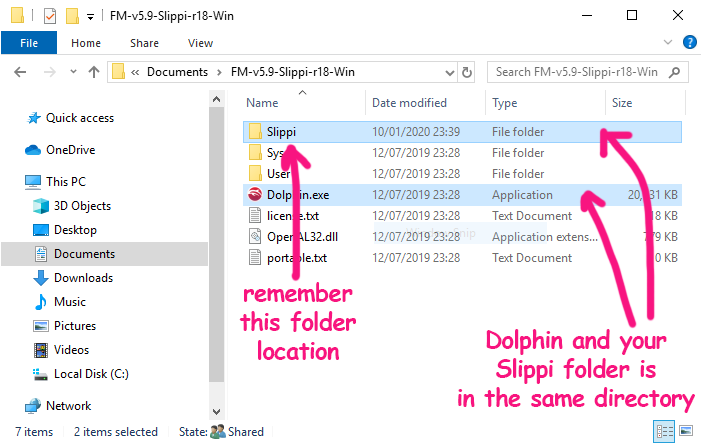
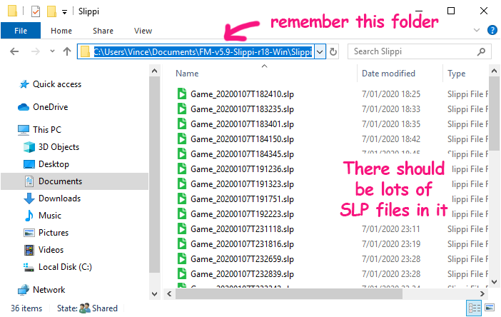
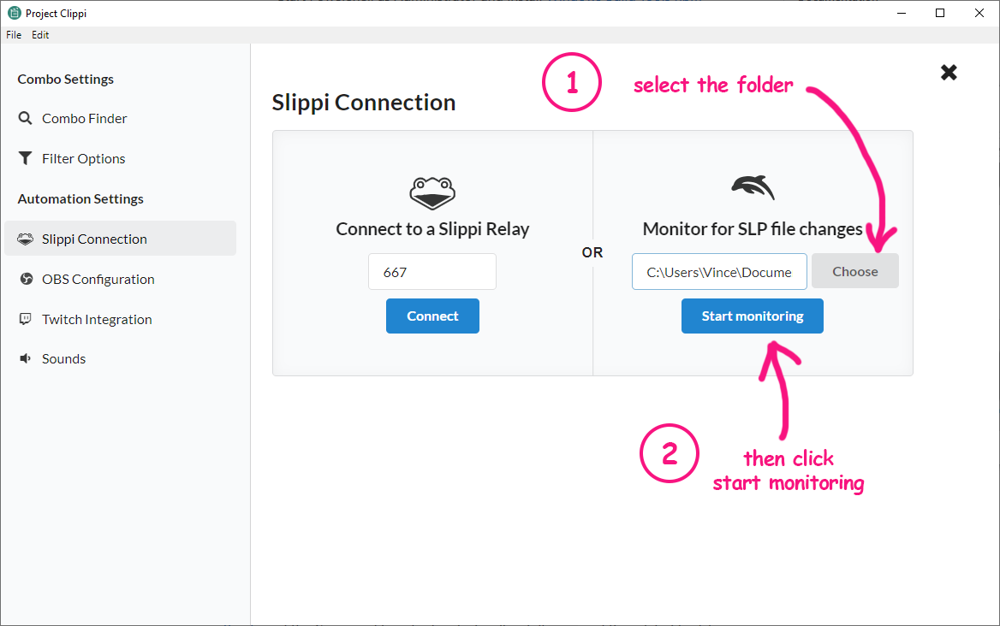

# Connecting to a live SLP folder

> **Disclaimer**: This feature has not been extensively tested. If you encounter issues, tweet at [@ProjectClippi](https://twitter.com/ProjectClippi) so we can get it fixed.

If you are playing on Slippi Dolphin, you won't have a relay port you can connect to. Instead you will need to know the location where your SLP files are stored.

## 1. Find the Folder to track SLP files

For Windows users using Slippi Dolphin, your SLP files are typically stored in a `Slippi` folder in the same location where your `Dolphin.exe` is.

## 2. Setup Project Clippi

Make sure you have the latest version of Project Clippi from [the releases page](https://github.com/vinceau/project-clippi/releases).

Open up the settings page and click "Slippi Connection".

In the right hand panel, where it says "Monitor for SLP file changes", click "Choose", and select the `Slippi` folder location. Click "Connect".

It should now say "Connected" and display the folder underneath.

## 3. Success!

You should now be ready to start customising different events and actions. Close the settings page and start automating!