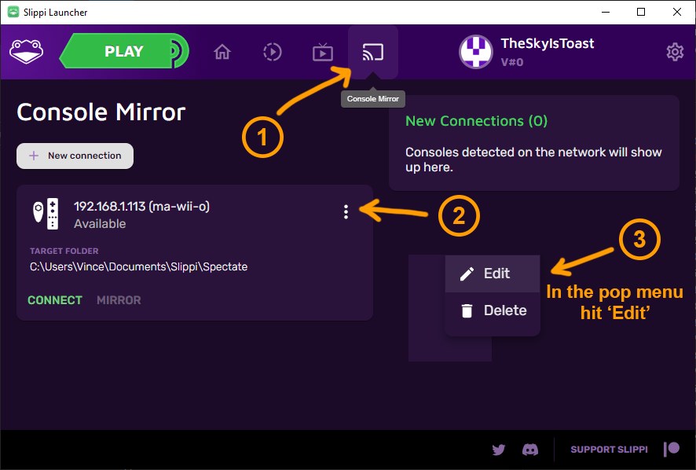
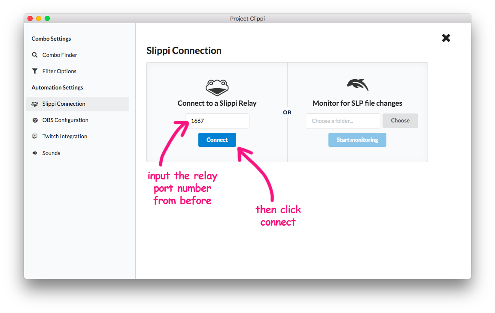
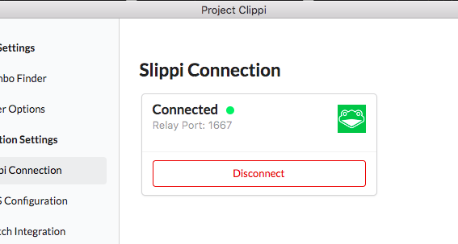

# Connecting to a Slippi Relay

This tutorial assumes that you have Slippi mirroring already set up. If you have not set up Slippi mirroring, follow [the Slippi mirroring guide](https://docs.google.com/document/d/1ezavBjqVGbVO8aqSa5EHfq7ZflrTCvezRYjOf51MOWg/edit) first before following the steps below.

## 1. Setup Slippi Launcher

Make sure you have the [Slippi Launcher](https://slippi.gg/downloads) installed.

Go to the Console Mirror page. Add a connection, or edit an existing connection.

Click the 'Show advanced options' button.

Scroll down and toggle on the 'Enable Console Relay' option. Then click "Submit" at the bottom to save changes.

You should now see "Relay Port" section next to your Wii connection. Remember this number since it will be important for later.

## 2. Setup Project Clippi

Make sure you have the latest version of Project Clippi from [the releases page](https://github.com/vinceau/project-clippi/releases).

Open up the settings page and click "Slippi Connection".

In the left hand panel, where it says "Connect to Slippi Relay", enter the number you saw before for the Relay Port. Click "Connect".

It should now say "Connected" and display the port underneath.

## 3. Success!

You should now be ready to start customising different events and actions. Close the settings page and start automating!
