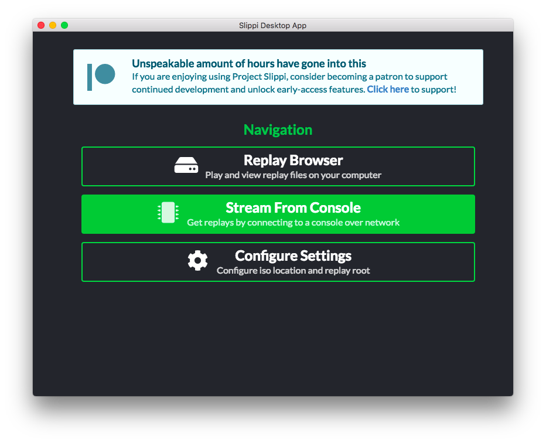
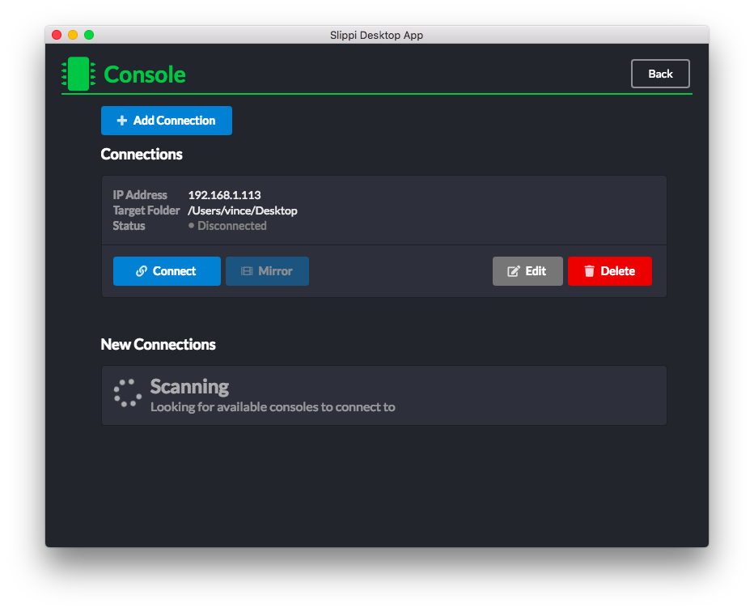

# Connecting to a Slippi Relay

This tutorial assumes that you have Slippi mirroring already set up. If you have not set up Slippi mirroring, [follow this guide](https://docs.google.com/document/d/1ezavBjqVGbVO8aqSa5EHfq7ZflrTCvezRYjOf51MOWg/edit) first before following the below steps.

## 1. Setup Slippi Desktop App

Make sure you have the [Slippi Desktop app](https://slippi.gg/downloads) installed.

At the main screen, click on "Stream from Console".

Next click, "Edit".

Switch to the "Advanced" tab, then enable "Wii Relay".

You should now see "Relay Port" section next to your Wii connection. Remember this number since it will be important for later.

